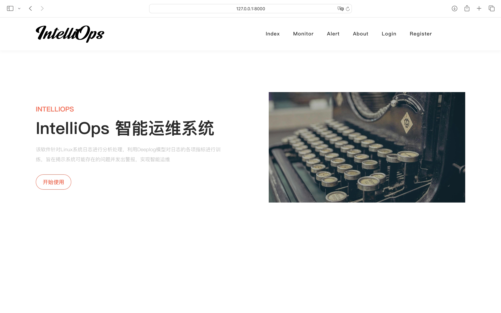

# IntelliOps

IntelliOps: An AIOps Web System.

> [!NOTE]
>
> Code is available at [GitHub](https://github.com/InfinityUniverse0/IntelliOps).

## Demo




## Quick Start

> [!NOTE]
>
> Suggested Python Version: `3.9` (Tested on `python 3.9.18`)

### Prerequisites

Make sure you have installed Python and MySQL.

### Python Requirements

You can use conda (recommended) to create a new python virtual env.

```sh
conda create -n web python=3.9.18
conda activate web
```

Then, install the requirements in the project directory:

```sh
pip install -r requriements.txt
```

### Database Setup

> [!NOTE]
>
> Make sure your MySQL service is running.

First, in your MySQL command line, run:

```mysql
CREATE DATABASE IntelliOps CHARSET = UTF8;
```

Then set up your MySQL database configuration in `IntelliOps/settings.py`. After that run Django database migrations:

```sh
python manage.py makemigrations
python manage.py migrate
```

Then initilize the database:

```sh
python init_db.py
```

### Start Project

```sh
python manage.py runserver 127.0.0.1:8000
```

> [!TIP]
>
> You can change the port as you want.

Visit `127.0.0.1:8000` for the IntelliOps Web Project.

## Project Structure

```sh
.
├── IntelliOps      # Project
│   ├── __init__.py
│   ├── asgi.py
│   ├── settings.py
│   ├── urls.py
│   └── wsgi.py
├── LICENSE
├── MainAPP         # App
│   ├── __init__.py
│   ├── admin.py
│   ├── apps.py
│   ├── migrations  # Django Migrations
│   ├── models.py
│   ├── tests.py
│   ├── urls.py
│   ├── utils       # utils
│   │   ├── __init__.py
│   │   └── query_log.py
│   └── views.py
├── README.md
├── data            # Data Path
├── init_db.py      # Database Initialization
├── manage.py
├── model           # DeepLog Model
│   ├── anomaly_detection.py
│   ├── ckpt
│   │   └── model.pth
│   └── model.py
├── preprocessing   # Data Preprocessing
│   ├── __init__.py
│   └── preprocessing.py
├── requirements.txt
├── static          # Static Files
│   ├── css
│   ├── font
│   ├── image
│   └── js
└── templates       # HTML Files
```
